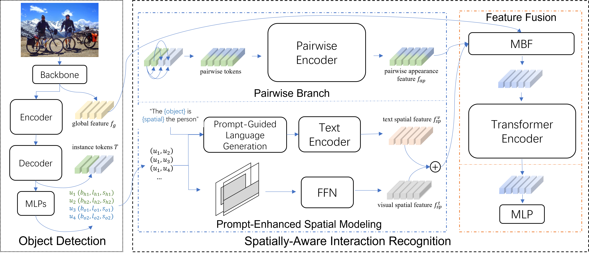

# Transformer-based Spatially-aware with Cross-modal Enhancement (TSCE) two-stage HOI Detector.



Abstract: *We propose a novel two-stage HOI detection model that incorporates cross-modal spatial information awareness.
Human-object relative spatial relationships are highly relevant for specific HOI species, but current approaches fail to model such crucial cues explicitly. We observed that relative spatial relationships possess properties that can be described in natural language easily and intuitively. 
Building on this observation and inspired by recent advancements in prompt-tuning, we design a Prompt-Enhanced Spatial Modeling (PESM) module that generates linguistic descriptions of spatial relations between humans and objects. 
PESM is capable of merging the explicit spatial information obtained by the aforementioned text descriptions with the implicit spatial information of the visual modality. Moreover, we devise a two-stage model architecture that effectively incorporates auxiliary cues to exploit the enhanced cross-modal spatial information.
Extensive experiments conducted on the HICO-DET benchmark demonstrate that the proposed model outperforms state-of-the-art methods, indicating its effectiveness and superiority.*

## Requirements
* python=3.6, cuda=11.4, pytorch=1.12.1
* Install the lightweight deep learning library [Pocket](https://github.com/fredzzhang/pocket). Install the packaging library with `pip install packaging`.

## Installation
1. Download the repository and the submodules.
```
git clone https://github.com/liugaowen043/tsce.git
cd tsce
git submodule init
git submodule update
```
2. prepare the datasets HICO-DET and V-COCO.
```
cd hicodet
bash download.sh
cd ..
cd vcoco
bash download.sh
```

## Training and Test
1. Download the relevant model parameters and place them in the checkpoints/ folder.
2. Training:
```
# HICO-DET
python main.py --world-size 4 --pretrained checkpoints/detr-r50-hicodet.pth --output-dir checkpoints/tsce-hicodet
# V-COCO
python main.py --world-size 4 --dataset vcoco --data-root vcoco/ --partitions trainval test --pretrained checkpoints/detr-r50-vcoco.pth --output-dir checkpoints/tsce-vcoco
```
3. Test:
```
# HICO-DET
python main.py --eval --resume path/of/model
# V-COCO
1. firstly cache the test result
python main.py --cache --dataset vcoco --data-root vcoco/ --partitions trainval test --output-dir output/path --resume path/of/model
2. eval result using the utilities provided by [Gupta et al.](https://github.com/s-gupta/v-coco#evaluation).
```


|Model|Full|Rare|Non-rare|TSCE Weights|DETR Weights|
|:-|:-:|:-:|:-:|:-:|:-:|
|TSCE-R50|32.00|27.10|33.46|[weights](https://www.jianguoyun.com/p/DZQXprMQioLlCxiEqpEFIAA)|[weights](https://www.jianguoyun.com/p/DXc5XnUQioLlCxj1qZEFIAA)|


|Model|Scenario 1|Scenario 2|TSCE Weights|DETR Weights|
|:-|:-:|:-:|:-:|:-:|
|TSCE-R50|59.4|65.0|[weights](https://www.jianguoyun.com/p/DcUSGTQQioLlCxiFqpEFIAA)|[weights](https://www.jianguoyun.com/p/DaExfnYQioLlCxj2qZEFIAA)|

## Acknowledgments
Our code is built on the foundation of UPT and we sincerely appreciate the excellent work in the past.